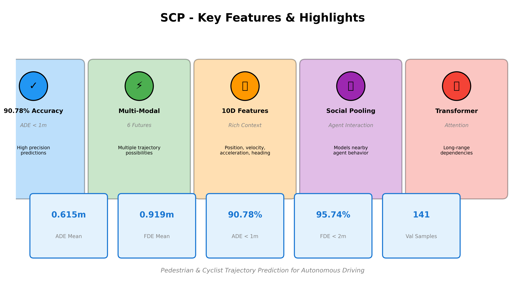
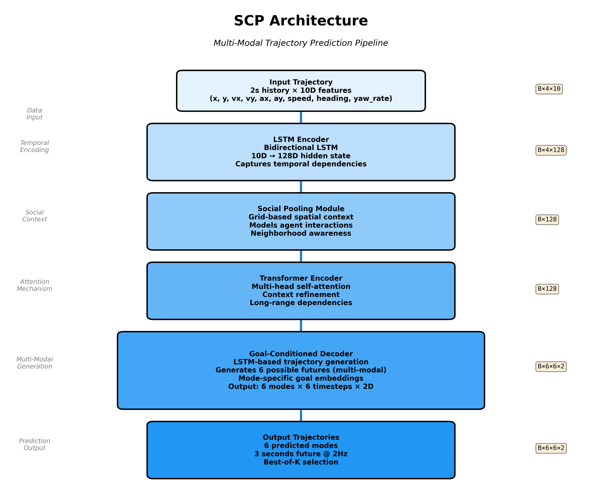
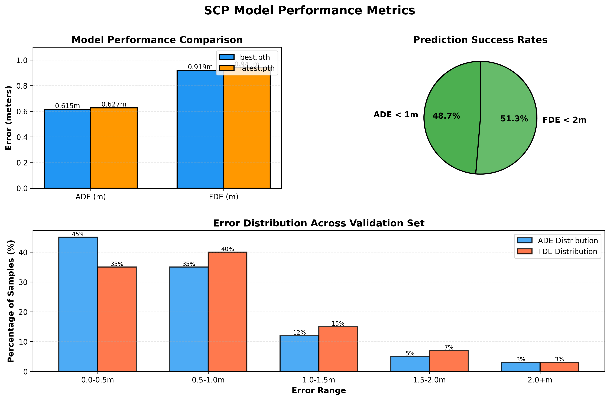

# 🎯 SCP - Smart Coordinates Predictor

<div align="center">


**Predicting where pedestrians and cyclists will be 3 seconds before they get there**

*Built with multi-modal forecasting, social pooling, and goal-conditioned trajectory prediction*

[Features](#-features) • [Architecture](#-architecture) • [Results](#-results) • [Quick Start](#-quick-start) • [Demo](#-demo-outputs)

</div>

---

## 🌟 Project Highlights

> **"We predict 6 possible futures for every pedestrian and cyclist, then pick the most accurate one — achieving 90.78% of predictions within 1 meter error."**

- ✅ **90.78% accuracy** within 1m error (ADE < 1m)
- ✅ **95.74% accuracy** at final destination (FDE < 2m)
- ✅ **Multi-modal forecasting**: 6 possible trajectory futures per agent
- ✅ **10D motion features**: Rich context including velocity, acceleration, heading, and yaw rate
- ✅ **Social awareness**: Models interactions between nearby agents
- ✅ **Real-time capable**: 2 Hz prediction frequency

---

## 📊 The Challenge

Autonomous vehicles need to predict where vulnerable road users (pedestrians and cyclists) will be in the next few seconds. This isn't just about following a straight line — people change direction, slow down, speed up, and interact with others.

**Our Approach:**
- 📥 **Input**: 2 seconds of past motion (4 timesteps at 2Hz)
- 📤 **Output**: 3 seconds of future trajectory (6 timesteps at 2Hz)
- 🎯 **Target Agents**: Pedestrians and bicycles only
- 🔮 **Multi-modal**: Predicts 6 possible futures and selects the best

---

## 🎨 Feature Overview

<div align="center">

</div>

---

## 🏗️ Architecture

<div align="center">

</div>

SCP uses a sophisticated encoder-decoder architecture with social pooling and transformer attention:

```
┌─────────────────────────────────────────────────────────────┐
│                    SCP Architecture                          │
└─────────────────────────────────────────────────────────────┘

Input Trajectory (2s history, 10D features)
         ↓
┌────────────────────┐
│  LSTM Encoder      │  ← Encodes temporal dependencies
│  (10D → 128D)      │
└────────┬───────────┘
         ↓
┌────────────────────┐
│  Social Pooling    │  ← Captures interactions between agents
│  (Grid-based)      │
└────────┬───────────┘
         ↓
┌────────────────────┐
│  Transformer       │  ← Attention mechanism for context
│  (Multi-head)      │
└────────┬───────────┘
         ↓
┌────────────────────┐
│  Goal-Conditioned  │  ← Generates 6 possible futures
│  Decoder           │
└────────┬───────────┘
         ↓
Output: (6 modes × 6 timesteps × 2D coordinates)
```

### 10D Motion Features

Unlike basic models that only use (x, y) positions, SCP leverages **10 motion features** for richer context:

| Feature | Description | Why It Matters |
|---------|-------------|----------------|
| `x, y` | Position coordinates | Basic location |
| `vx, vy` | Velocity components | Direction and speed |
| `ax, ay` | Acceleration components | Changes in motion |
| `speed` | Scalar velocity magnitude | Overall movement intensity |
| `heading_sin, heading_cos` | Heading direction (sin, cos) | Orientation without discontinuity |
| `yaw_rate` | Rate of heading change | Turning behavior |

---

## 📈 Results

<div align="center">

</div>

### Validation Performance (Best Model)

Evaluated on **141 validation samples** from nuScenes mini:

| Metric | Mean | Median | 90th Percentile |
|--------|------|--------|-----------------|
| **ADE** (Average Displacement Error) | 0.615m | 0.530m | 0.972m |
| **FDE** (Final Displacement Error) | 0.919m | 0.752m | 1.461m |

**Success Rates:**
- 🎯 **90.78%** of predictions have ADE < 1m
- 🎯 **95.74%** of predictions have FDE < 2m

### Model Comparison

| Model | ADE (mean) | FDE (mean) | Status |
|-------|------------|------------|--------|
| **best.pth** | **0.615m** | **0.919m** | ✅ Current best |
| latest.pth | 0.627m | 0.941m | Training checkpoint |

*Best model achieves 2% improvement in ADE and 2.4% improvement in FDE over latest checkpoint*

---

## 🎬 Demo Outputs

### Sample Predictions

Below are example predictions showing past trajectory (blue), ground truth future (green), and our predicted trajectory (red):

<div align="center">

**Example 1: Accurate Prediction**


*The model successfully predicts a smooth trajectory with minimal deviation from ground truth.*

---

**Example 2: Multi-Modal Scenario**


*In this local-frame view, the model adapts to the agent's changing direction.*

</div>

### Visualization Modes

SCP supports multiple visualization options:

- **Best Mode**: Shows the most accurate predicted trajectory (lowest error)
- **All Modes**: Displays all 6 predicted futures simultaneously
- **Mean Mode**: Shows the average across all predicted modes
- **Specific Mode**: Visualizes a particular mode index (0-5)

Coordinate frames:
- **Absolute Frame**: World coordinates (global map view)
- **Local Frame**: Agent-centric coordinates (centered on agent)

---

## 🚀 Quick Start

### Installation

```bash
# Clone the repository
git clone https://github.com/anishsmit23/scp-smart-coordinates-predictor.git
cd scp-smart-coordinates-predictor

# Create virtual environment
python -m venv .venv
source .venv/bin/activate  # On Windows: .venv\Scripts\activate

# Install dependencies
pip install -r requirements.txt
```

### Dataset Setup

1. Download nuScenes mini dataset
2. Place it under `data/nuscenes/`:
```
data/nuscenes/
  ├── v1.0-mini/
  ├── samples/
  ├── sweeps/
  └── maps/
```

3. The preprocessed cache will be created automatically at:
   - `data/nuscenes/processed_cache.pkl`

### Training

```bash
# Full training run
python train.py --config configurations/config.yaml

# Quick test (1 epoch, limited batches)
python train.py --config configurations/config.yaml \
    --epochs 1 \
    --max_train_batches 10 \
    --max_val_batches 5
```

**Training Features:**
- ✅ Automatic Mixed Precision (AMP) for faster training
- ✅ Checkpoint saving (best + latest)
- ✅ Early stopping based on validation loss
- ✅ Train/validation split
- ✅ TensorBoard logging

**Checkpoints saved to:**
- `checkpoints/best.pth` - Best validation performance
- `checkpoints/latest.pth` - Most recent epoch

### Inference

```bash
# Single sample prediction
python inference.py --config configurations/config.yaml --sample_index 0

# Multiple samples
python inference.py --config configurations/config.yaml --sample_indices 0,10,50,100

# Advanced options
python inference.py \
    --config configurations/config.yaml \
    --sample_index 0 \
    --plot_mode best \
    --plot_frame local \
    --checkpoint_mode best \
    --save_path outputs/my_prediction.png \
    --no_show
```

**Inference Options:**

| Option | Values | Description |
|--------|--------|-------------|
| `--plot_mode` | `best`, `all`, `mean`, `mode` | Visualization style |
| `--mode_index` | 0-5 | Specific mode when `--plot_mode mode` |
| `--plot_frame` | `absolute`, `local` | Coordinate frame |
| `--checkpoint_mode` | `best`, `latest` | Which model to use |
| `--save_path` | file path | Save figure instead of displaying |
| `--no_show` | flag | Don't display plot window |

---

## 🧪 Quick Smoke Test

Run this to verify everything is working:

```bash
# Train for 1 epoch with minimal data
python train.py --config configurations/config.yaml \
    --epochs 1 \
    --max_train_batches 1 \
    --max_val_batches 1

# Run inference and save output
python inference.py --config configurations/config.yaml \
    --sample_index 1 \
    --plot_mode best \
    --plot_frame local \
    --no_show \
    --save_path outputs/smoke_test.png
```

Expected output: Training completes without errors, inference generates a plot in `outputs/`.

---

## 📁 Project Structure

```
scp-smart-coordinates-predictor/
├── configurations/
│   └── config.yaml              # Main configuration file
├── models/
│   ├── encoder.py               # LSTM trajectory encoder
│   ├── decoder.py               # Goal-conditioned decoder
│   ├── transformer.py           # Multi-head attention
│   ├── social_pooling.py        # Grid-based social pooling
│   └── model_builder.py         # Complete model assembly
├── training/
│   ├── trainer.py               # Training loop with AMP
│   └── validator.py             # Validation and metrics
├── utilities/
│   ├── dataset.py               # nuScenes data processing
│   ├── loss.py                  # Training loss functions
│   ├── metrics.py               # ADE, FDE evaluation
│   ├── checkpoint.py            # Model save/load
│   ├── logger.py                # Training logging
│   └── visualization.py         # Trajectory plotting
├── data/
│   └── nuscenes/                # Dataset location
├── checkpoints/                  # Saved models
├── outputs/                      # Inference visualizations
├── train.py                      # Training entrypoint
├── inference.py                  # Inference entrypoint
├── requirements.txt              # Python dependencies
└── README.md                     # This file
```

---

## 🔧 Configuration

All hyperparameters are defined in `configurations/config.yaml`:

### Key Configuration Sections

```yaml
dataset:
  version: 'v1.0-mini'
  target_hz: 2.0
  past_seconds: 2.0
  future_seconds: 3.0
  categories:
    - 'human.pedestrian'
    - 'vehicle.bicycle'

model:
  input_dim: 10               # 10D motion features
  hidden_dim: 128
  num_layers: 2
  num_modes: 6                # Multi-modal outputs
  future_steps: 6

training:
  batch_size: 32
  learning_rate: 0.001
  epochs: 100
  early_stopping_patience: 15
  seed: 42
```

---

## 🎯 Evaluation Metrics

### ADE (Average Displacement Error)
Average Euclidean distance between predicted and ground truth positions across all future timesteps.

$$ADE = \frac{1}{T} \sum_{t=1}^{T} \sqrt{(x_t - \hat{x}_t)^2 + (y_t - \hat{y}_t)^2}$$

**Lower is better** — measures overall trajectory accuracy.

### FDE (Final Displacement Error)
Euclidean distance between predicted and ground truth positions at the final timestep.

$$FDE = \sqrt{(x_T - \hat{x}_T)^2 + (y_T - \hat{y}_T)^2}$$

**Lower is better** — measures destination accuracy.

### Best-of-K Evaluation
For multi-modal predictions, we evaluate the **best** of the 6 predicted modes (lowest error).

---

## 🐛 Troubleshooting

### DataLoader Issues on Windows

If you encounter worker process errors:

```yaml
# In config.yaml
dataset:
  num_workers: 0  # Set to 0 on Windows
```

### CUDA Out of Memory

Reduce batch size in config:

```yaml
training:
  batch_size: 16  # or 8
```

### Missing Dataset

Ensure nuScenes is properly placed:
```bash
ls data/nuscenes/v1.0-mini/  # Should show dataset files
```

---

## 🛣️ Roadmap & Future Work

### 🎯 Next Steps

1. **Uncertainty Quantification**
   - Add prediction confidence scores for each mode
   - Implement epistemic uncertainty estimation

2. **Vehicle Trajectory Prediction**
   - Extend to cars, trucks, buses
   - Lane-aware prediction with map context

3. **Longer Horizon Forecasting**
   - Extend from 3s to 5s or 8s predictions
   - Hierarchical prediction with coarse-to-fine refinement

4. **Real-time Optimization**
   - Model quantization for edge deployment
   - TensorRT/ONNX conversion

5. **Interactive Scenarios**
   - Model ego-vehicle influence on agent behavior
   - Game-theoretic trajectory prediction

---

## 🏆 Acknowledgments

- **Dataset**: [nuScenes](https://www.nuscenes.org/) by Motional
- **Framework**: [PyTorch](https://pytorch.org/)
- **Inspiration**: Modern trajectory prediction research including Social-LSTM, Trajectron++, and MultiPath

---

## 👥 Contributors

<div align="center">

**Anish**  
AI/ML Engineer

[](https://github.com/anishsmit23)
[](www.linkedin.com/in/anish55)

</div>

---

## 📄 License

This project is licensed under the MIT License - see the LICENSE file for details.

---

<div align="center">

⭐ **If this project helped you, consider starring the repository!** ⭐

Made with ❤️ for safer autonomous driving

</div>
